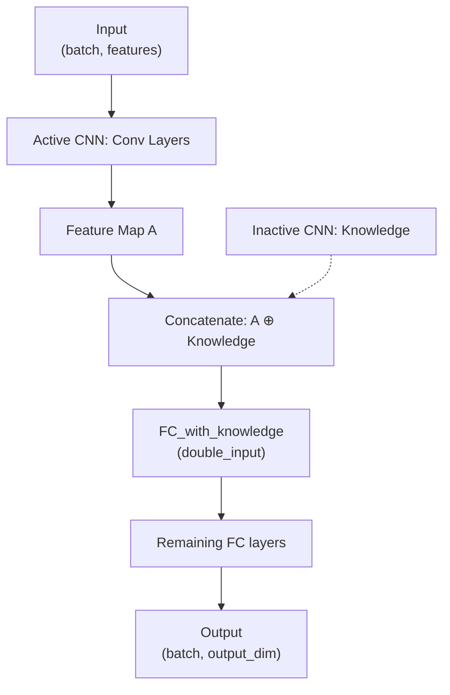
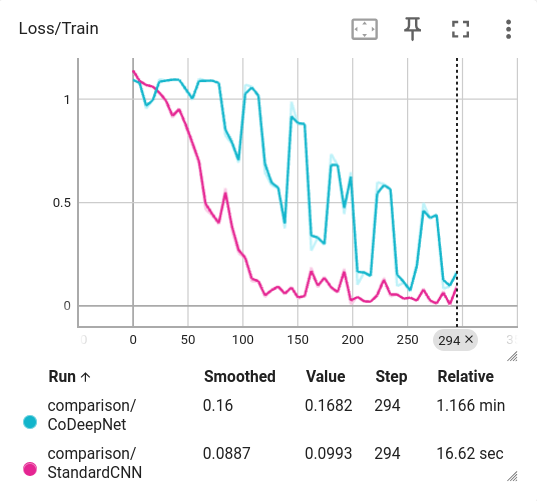
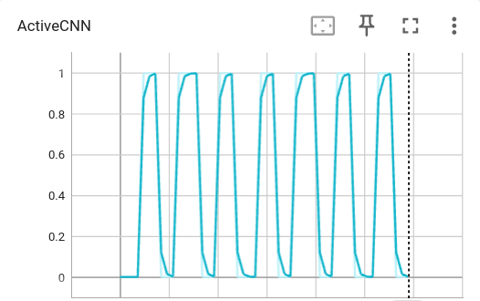

# CoDeepNet: Cooperative Deep Neural Networks

A PyTorch implementation of the Cooperative Deep Neural Network (Co-DeepNet) architecture, featuring dynamic knowledge transmission between alternating CNN pairs.

## Overview

CoDeepNet implements a novel cooperative learning paradigm where two identical CNNs alternate activity, sharing learned features through periodic knowledge transmission. This architecture demonstrates how neural networks can cooperate rather than compete, enabling distributed learning with feature-level communication.

## Architecture

### Core Components

**Dual CNN System**
- Two identical CNNs (CNN_A and CNN_B) that alternate training
- Only one CNN is active per iteration while the other provides knowledge
- Knowledge transmission occurs every K iterations (default: 20)

**Dynamic Architecture**
- Configurable convolutional depth (1-N layers)
- Configurable fully connected depth (1-N layers)
- Automatic feature size calculation through conv/pool operations
- Adaptive pooling based on remaining feature dimensions

**Knowledge Transmission**
- Last feature map from inactive CNN feeds into active CNN
- Special FC layer handles concatenated knowledge: `[active_features || inactive_features]`
- Gradient detachment prevents backprop across inactive CNN
- Alternating updates ensure both CNNs evolve complementary representations

### Network Flow


## Implementation Details

### CNN Architecture (`ml/models/arch.py`)

**Convolutional Layers**
- 1D convolutions for tabular/sequential data
- Channel scaling: `base_channels * (3^i)` per layer
- MaxPool1d (kernel=2, stride=1) with adaptive disabling
- Feature dimension tracking through conv/pool operations

**Fully Connected Layers**
- Progressive dimension reduction: `base_units * (0.7^i)`
- Dual FC paths:
  - `fc_layers`: Normal path without knowledge
  - `fc_with_knowledge`: Special path accepting concatenated features

**Knowledge Integration**
```python
# With knowledge transmission
x = [last_feature_map, transferred_knowledge.detach()]
x = fc_with_knowledge(x)  # Double input → same output as fc_layers[0]
x = fc_layers[1:](x)      # Continue through remaining layers

# Without knowledge transmission
x = last_feature_map
x = fc_layers(x)          # Use all layers normally
```

### Training Loop (`ml/models/train.py`)

**Algorithm 1: Cooperation Between CNNs**
```
For each epoch:
  For each batch:
    1. Forward pass through active CNN with knowledge from inactive CNN
    2. Compute loss and backprop (only active CNN parameters updated)
    3. Increment iteration counter
    4. If iteration % K == 0:
       - Switch active CNN
       - Transfer knowledge via last feature map
```

**Key Features**
- Optimizer targets `model.parameters()` but only active CNN gradients flow
- TensorBoard logging tracks which CNN is active per iteration
- Knowledge transmission events logged separately
- Validation runs through active CNN at epoch end

### Configuration

```python
CNNConfig(
    input_features=4,           # Number of input features
    output_dim=1,               # Output dimension
    conv_depth=2,               # Number of conv layers
    fc_depth=2,                 # Number of FC layers
    conv_base_channels=3,       # Conv channels: 3, 9, 27, ...
    fc_base_units=120,          # FC units: 120, 84, ...
    kernel_size=3,
    stride=1,
    activation='relu'           # 'relu', 'tanh', or 'sigmoid'
)
```

## Experimental Results

### Dataset: Iris (3 features → 1 regression target)


*Training loss showing standard CNN converges faster than CoDeepNet on this simple task*


*Binary indicator showing which CNN is active over time (0=CNN_A, 1=CNN_B)*

### Observations

**Knowledge Transmission Rate = 20 iterations**
- CNNs alternate every 20 training batches
- Clear switching pattern visible in activity graph
- Both CNNs contribute to final model performance

**Convergence Characteristics**
- Standard CNN shows faster initial convergence
- CoDeepNet exhibits more oscillatory learning pattern
- Switching events create temporary loss perturbations
- Final performance comparable despite cooperative overhead

**Architectural Insights**
- Simple tasks (Iris) may not benefit from cooperation complexity
- Knowledge transmission overhead visible in loss curve
- Both CNNs develop complementary feature representations
- Inactive CNN features influence active CNN decision boundaries

## Usage

### Basic Training

```python
from ml.models.arch import CoDeepNet, CNNConfig
from ml.models.train import CoDeepNetTrainer, load_iris_data

# Configure architecture
config = CNNConfig(
    input_features=3,
    output_dim=1,
    conv_depth=5,
    fc_depth=2,
    conv_base_channels=3,
    fc_base_units=120,
    activation='relu'
)

# Load data
train_loader, val_loader = load_iris_data(
    batch_size=16,
    regression_target=True
)

# Initialize and train
model = CoDeepNet(config, knowledge_transmission_rate=20)
trainer = CoDeepNetTrainer(
    model=model,
    train_loader=train_loader,
    val_loader=val_loader,
    log_dir="./tensorboard",
    knowledge_transmission_rate=20
)

trained_model = trainer.train(epochs=50)
```

### Monitoring with TensorBoard

```bash
make tensorboard
# Navigate to http://localhost:6006
```

**Tracked Metrics**
- `Loss/Train_CNN_A`: Training loss when CNN_A is active
- `Loss/Train_CNN_B`: Training loss when CNN_B is active
- `Loss/Train_Epoch`: Average epoch loss
- `Loss/Validation`: Validation loss
- `KnowledgeTransmission/Network`: Binary indicator (0=A, 1=B)
- `KnowledgeTransmission/Switch`: Switch event timestamps

## Implementation Highlights

### Dynamic Architecture Building

```python
# Automatic feature size tracking
for i in range(conv_depth):
    conv = Conv1d(in_channels, out_channels, kernel_size, stride, padding)

    can_pool = feature_size >= 2
    pool = MaxPool1d(2, 1) if can_pool else Identity()

    if can_pool:
        feature_size -= 1  # Pool reduces by 1 with kernel=2, stride=1
```

### Knowledge Flow Control

```python
# Forward pass with optional knowledge
output, last_feature_map = cnn(x, transferred_knowledge)

# Active/inactive management
if A_is_active:
    output, last_feature_map_A = cnn_A(x, last_feature_map_B)
else:
    output, last_feature_map_B = cnn_B(x, last_feature_map_A)
```

### Gradient Isolation

```python
# Detach inactive knowledge to prevent gradient flow
x = torch.cat([last_feature_map, transferred_knowledge.detach()], dim=1)
```

## Design Decisions

**Why Double-Input FC Layer?**
- Concatenating knowledge doubles input dimension
- `fc_with_knowledge` maintains output dimension consistency
- Allows seamless integration with remaining FC layers
- Prevents dimension mismatch in cooperative mode

**Why Detach Transferred Knowledge?**
- Prevents gradient backprop into inactive CNN
- Maintains clean separation between active/inactive parameter updates
- Ensures only active CNN trains on current batch
- Inactive CNN features treated as fixed context

**Why Adaptive Pooling?**
- Small feature dimensions can't support aggressive pooling
- Dynamic disabling prevents negative dimensions
- Enables deep architectures on low-dimensional inputs
- Graceful degradation for constrained feature spaces

## Future Directions

- Test on complex datasets (ImageNet, CIFAR-100)
- Experiment with asymmetric CNN architectures
- Variable knowledge transmission rates
- Multi-CNN cooperation (N > 2)
- Knowledge compression techniques
- Attention-based knowledge selection

## Requirements

```
torch>=2.0.0
scikit-learn>=1.0.0
numpy>=1.21.0
tensorboard>=2.10.0
```

## Project Structure

```
CoDeepNet/
├── ml/
│   └── models/
│       ├── arch.py          # CNN & CoDeepNet architectures
│       ├── train.py         # Training loop & data loading
│       └── compare.py       # Comparison with standard CNN
├── media/
│   ├── active_graph.png     # CNN activity visualization
│   └── train.png            # Training loss comparison
├── tensorboard/             # TensorBoard logs
└── README.md
```

## References

This implementation is based on:

**Jaddi, N. S., Saniee Abadeh, M., Bagheri Khoulenjani, N., Abdullah, S., Ariannejad, M., Ahmad Nazri, M. Z., & Alvankarian, F. (2025).** *Co-DeepNet: A Cooperative Convolutional Neural Network for DNA Methylation-Based Age Prediction.* CAAI Transactions on Intelligence Technology, 10(4), 1118-1134. https://doi.org/10.1049/cit2.70026

**BibTeX:**
```bibtex
@article{jaddi2025codeepnet,
  author = {Jaddi, Najmeh Sadat and Saniee Abadeh, Mohammad and Bagheri Khoulenjani, Niousha and Abdullah, Salwani and Ariannejad, MohammadMahdi and Ahmad Nazri, Mohd Zakree and Alvankarian, Fatemeh},
  title = {Co-DeepNet: A Cooperative Convolutional Neural Network for DNA Methylation-Based Age Prediction},
  journal = {CAAI Transactions on Intelligence Technology},
  volume = {10},
  number = {4},
  pages = {1118-1134},
  keywords = {age prediction, convolutional neural network, cooperative, genetic algorithm, knowledge transmission},
  doi = {https://doi.org/10.1049/cit2.70026},
  url = {https://ietresearch.onlinelibrary.wiley.com/doi/abs/10.1049/cit2.70026},
  year = {2025}
}
```

## License

MIT

---

*Implementation of the Co-DeepNet architecture from Jaddi et al. (2025)*
